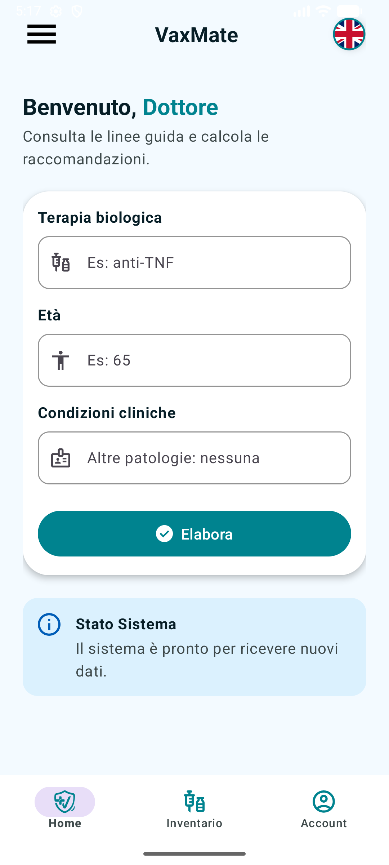
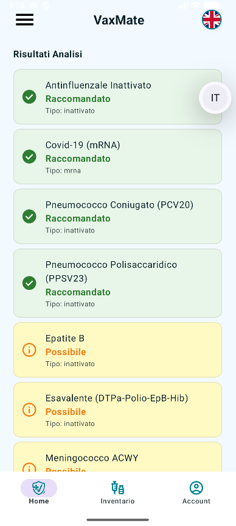
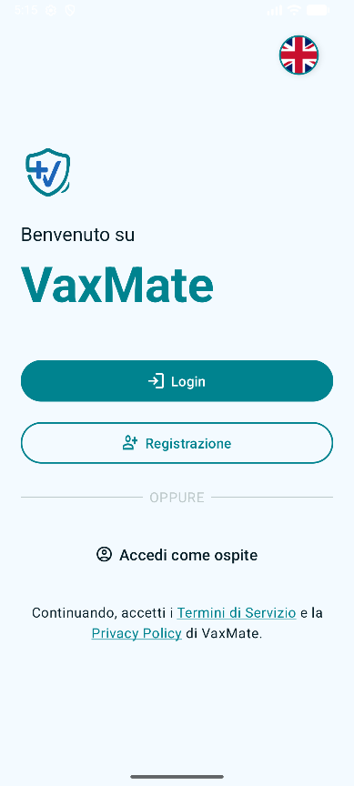
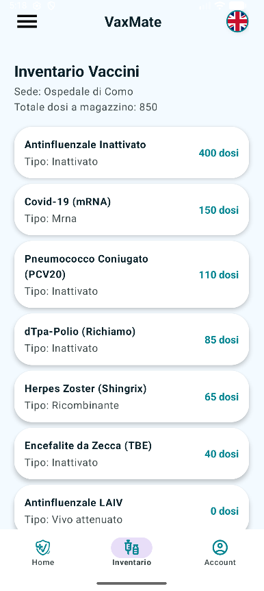
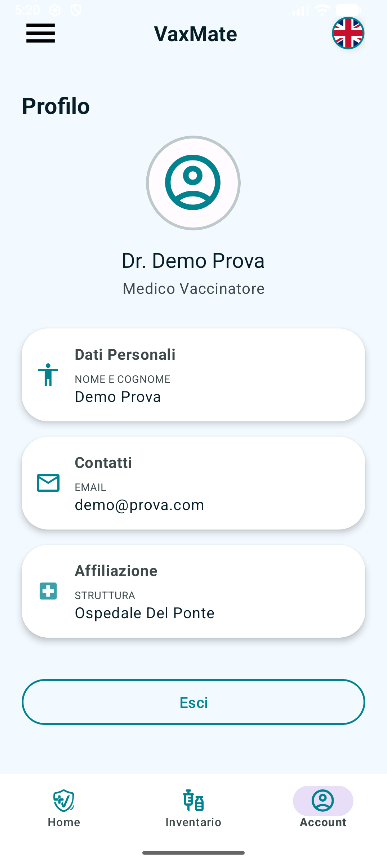

# VaxMate (Progetto Vaccini)

VaxMate è un'applicazione mobile sviluppata per il corso di "Programmazione di Dispositivi Mobili" (Prof. Ignazio Gallo) presso l'Università dell'Insubria.

L'obiettivo del nostro progetto è fornire indicazioni vaccinali per i pazienti in terapia biologica. L'abbiamo pensata come un vero e proprio sistema di supporto decisionale: da un lato c'è un'area pubblica per l'applicazione delle linee guida cliniche, dall'altro un'area riservata ai medici per la gestione e consultazione degli inventari dei propri ospedali.

---

## Funzionalità Principali

* **Calcolatore Clinico:** Un algoritmo che analizza la terapia biologica del paziente (es. anti-TNF), l'età e le condizioni cliniche, per restituire in tempo reale quali vaccini sono **Raccomandati**, **Possibili** o **Controindicati**. Questa sezione è accessibile a chiunque senza bisogno di account.
* **Area Riservata Medici:** Abbiamo implementato un sistema di registrazione e login. Solo il personale sanitario autenticato può accedere alle funzioni di gestione ospedaliera.
* **Inventari Ospedalieri:** Una volta loggato, il medico può consultare le scorte di magazzino relative alla propria struttura (es. Ospedale di Circolo Varese, Ospedale Del Ponte). L'app scarica i lotti dal database e li incrocia con il catalogo vaccini per mostrare le dosi totali disponibili, ordinandole in modo decrescente.
* **Supporto Bilingue (Italiano/Inglese):** L'intera applicazione è localizzata in due lingue. Per gestire i dati dinamici, abbiamo strutturato i documenti del database in formato bilingue (es. `nome_it` e `nome_en`), permettendo all'app di formattare i testi in base alle impostazioni di sistema del dispositivo.

---

## Screenshot applicazione

  
  
  
  
  

---

## Stack Tecnologico e Architettura

* **Linguaggio:** Kotlin
* **IDE:** Android Studio
* **UI:** Componenti Material Design e View Binding
* **Backend & Database:** Firebase Authentication (per l'accesso sicuro dei medici) e Firebase Firestore (database NoSQL per i cataloghi vaccini, i profili medici e gli inventari).

---

## Autori del progetto

Progetto sviluppato da:
* **Matteo Franguelli**
* **Celestino Resteghini**

---

## Licenza

Questo progetto è open-source e rilasciato sotto i termini della **MIT License**.
Per maggiori dettagli, consultare il file `LICENSE`.
